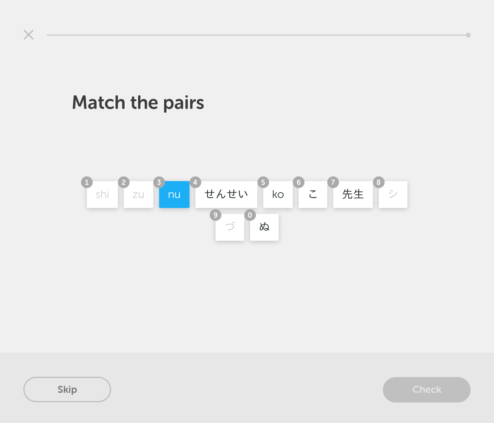
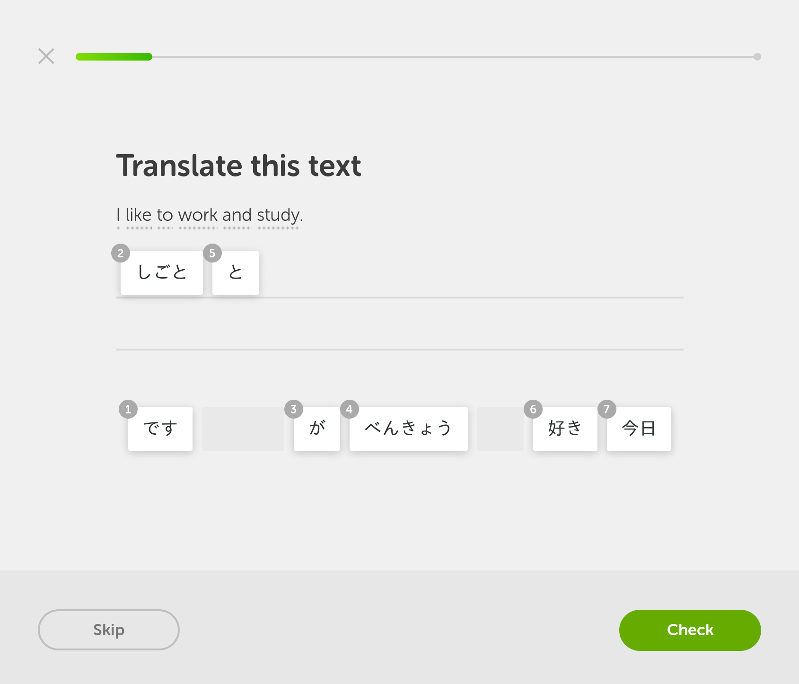

# More Duolingo hotkeys

This UserScript allows doing all exercises exclusively with the keyboard (without needing to use the mouse).

## Installation

1. Install [Greasemonkey](https://addons.mozilla.org/en-US/firefox/addon/greasemonkey/) for Firefox or [Tampermonkey](https://chrome.google.com/webstore/detail/tampermonkey/dhdgffkkebhmkfjojejmpbldmpobfkfo?hl=en) for Chrome.
2. [Click here](https://github.com/CyberShadow/DuolingoMoreKeys/raw/master/More_keyboard_hotkeys.user.js) to install this UserScript.

## Screenshots





## Configuration

You can change the keys used to select answer choices using the following steps:

1. Open https://www.duolingo.com/ in your web browser
2. Press F12 to open the developer console
3. Open the "Console" tab in the developer console (or your web browser's equivalent)
4. At the prompt at the bottom, type:

   ```javascript
   window.localStorage.duolingoMoreKeysLayout = '1234567890ABCDEFGHIJKLMNOPQRSTUVWXYZ';
   ```

   Change the list of keys between the quotes to your desired digits or letters. Letters should be in UPPER CASE. The keys will be used in the order specified.
5. Close the developer console by pressing F12.

To reset the keys to the default value, do the same steps above, but at step 4, enter instead:

```javascript
delete window.localStorage.duolingoMoreKeysLayout;
```
